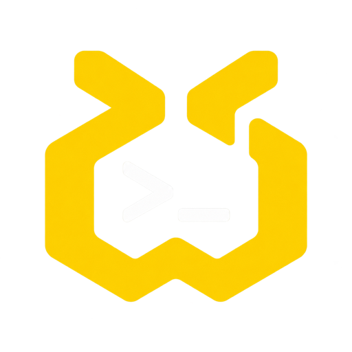

<h1 align="center">
  <a href="https://www.agentty.run"></a> Agentty
</h1>

<p align="center">
  <a href="https://github.com/empty-user77/Agentty"></a>
  <a href="https://github.com/empty-user77/Agentty/releases"></a>
  <a href="LICENSE"></a>
  <a href="https://x.com/agentty_run"></a>
  
</p>

<p align="center">
  <sub><a href="README.md">English</a> · <b>한국어</b> · <a href="README.ja.md">日本語</a> · <a href="README.zh.md">中文</a></sub>
</p>

<p align="center">
  <strong>AI-네이티브 워크플로우를 위한 오케스트레이션 터미널입니다.</strong><br/>
  Claude Code, Codex 및 여러 에이전트를 나란히 실행하며, 누가 작업 중인지, 끝났는지, 응답을 기다리는지 한눈에 파악합니다.
</p>

<h3 align="center"><a href="https://github.com/empty-user77/Agentty/releases/latest"><ins>Agentty 다운로드</ins></a> · <a href="https://www.agentty.run/docs"><ins>문서</ins></a></h3>

<p align="center">
  
</p>

Rust로 만들어진 네이티브 GPU 렌더링 터미널입니다. [GPUI](https://gpui.rs)와 `alacritty_terminal`을 사용하며 Electron은 없습니다.
모든 에이전트에게 작업에 필요한 것 — 프로젝트의 파일, Git 이력, 컨테이너, 데이터베이스 — 을 함께 제공합니다.

## 기능

<table>
<tr>
<td width="50%" valign="top">

### 모든 에이전트를 한 창에서

워크스페이스, 탭, 분할창으로 터미널, Claude Code, Codex 및 다른 CLI 에이전트를 관리하며 재시작 후에도 모두 복원됩니다.

[문서 →](https://www.agentty.run/docs/workspaces-tabs-panes)

</td>
<td width="50%" valign="top">

### 나를 기다리는 에이전트를 한눈에

각 페인과 워크스페이스에서 에이전트가 작업 중인지, 완료했는지, 응답을 기다리는지 표시됩니다. 데스크톱, 메뉴 막대는 물론 Slack, Discord, Telegram으로도 알림을 받습니다.

[문서 →](https://www.agentty.run/docs/agent-status)

</td>
</tr>
<tr>
<td width="50%" valign="top">

### 세션 연결

한 에이전트에서 다른 에이전트로 선을 이어 컨텍스트를 넘기고, 양방향으로 동기화하거나, Claude Code와 Codex 사이에서 대화를 이동할 수 있습니다.

[문서 →](https://www.agentty.run/docs/session-flow)

</td>
<td width="50%" valign="top">

### 병렬 워크트리

같은 프로젝트에 두 번째 에이전트가 들어오면 새 브랜치의 별도 git 워크트리를 시작하거나 이미 사용 중인 워크트리에 참여할 수 있습니다. 에이전트가 작업을 여러 세션으로 나누자고 요청하면 확인 후 한 번에 시작됩니다.

[문서 →](https://www.agentty.run/docs/agent-git)

</td>
</tr>
<tr>
<td width="50%" valign="top">

### AgentGit

저장소와 브랜치를 전환하고, diff를 검토하고, 파일을 선택적으로 커밋하고, 이력을 탐색하고, fetch, pull, push, merge를 모두 에이전트가 실행되는 창을 벗어나지 않고 수행합니다.

[문서 →](https://www.agentty.run/docs/agent-git)

</td>
<td width="50%" valign="top">

### 인앱 브라우저

개발 서버를 터미널 옆에 열어 휴대폰과 태블릿 크기로도 볼 수 있으며, 에이전트가 페이지를 직접 조작해서 만든 것을 테스트할 수 있습니다.

[문서 →](https://www.agentty.run/docs/in-app-browser)

</td>
</tr>
<tr>
<td width="50%" valign="top">

### 데이터베이스 & Docker

프로젝트가 이미 설정한 데이터베이스를 탐색할 수 있습니다. 에이전트의 조회는 읽기 전용 트랜잭션 안에서 실행되고, 쓰기는 실행할 정확한 SQL을 보여 주는 승인 창을 통과해야만 실행됩니다. 컨테이너, 포트, 로그도 함께 표시됩니다.

[문서 →](https://www.agentty.run/docs/databases)

</td>
<td width="50%" valign="top">

### 플러그인 & 자동화

플러그인은 터미널 옆 패널을 채우고, 에이전트 페인 위에 버튼과 명령 팔레트 항목을 추가하며, 자동화 에이전트를 자신만의 워크스페이스에서 실행합니다. [Marketplace](https://github.com/empty-user77/Agentty-Marketplace)에서 찾거나 직접 만들 수 있습니다.

[문서 →](https://www.agentty.run/docs/plugins-overview)

</td>
</tr>
</table>

**추가 기능:**

- **[세션](https://www.agentty.run/docs/sessions)** — 이미 컴퓨터에 있는 Claude Code와 Codex 세션을 찾고, 검색하고, 다시 시작할 수 있습니다.
- **[모니터링](https://www.agentty.run/docs/monitoring)** — 로컬 대화 기록으로 계산한 비용·토큰·캐시 적중률, 실행 중인 AI 프로세스, 컴퓨터의 모든 git 워크트리, 빌드 결과물과 캐시를 정리하는 디스크 페이지.
- **[확장, MCP와 커넥터](https://www.agentty.run/docs/mcp-and-connectors)** — Claude Code와 Codex의 스킬, 서브에이전트, 명령, MCP 서버를 한곳에서 보고, 비밀값은 OS에서 관리합니다.
- **[Build my idea](https://www.agentty.run/docs/build-my-idea)** 와 **[Launch](https://www.agentty.run/docs/launch)** — 몇 줄의 설명을 에이전트가 구현할 수 있는 프로젝트로 바꾸고, GitHub, Vercel, Supabase에서 공개합니다.
- **[Claude advisor](https://www.agentty.run/docs/advisor)** — Claude Code가 더 강력한 모델에 조언을 구하게 할 수 있으며, 탭마다 설정합니다.
- **파일 & 편집기** — 프로젝트 트리와 구문 강조, 포매터가 있는 편집기, VS Code나 Cursor에서 열기.
- **명령 팔레트, 안 읽은 알림으로 이동, 미니 모드** — ⇧⌘P, ⇧⌘U, ⌃⌘M; [단축키](#단축키)를 참고하세요.

---

## 지원하는 에이전트

**모든 CLI 에이전트**에서 작동합니다 — 터미널에서 실행되면 Agentty에서도 실행됩니다. 아래 에이전트는 Agentty가 자동으로 찾아 실행 메뉴에 보여 줍니다:

<p>
  <a href="https://docs.anthropic.com/en/docs/claude-code"><kbd> Claude Code</kbd></a> &nbsp;
  <a href="https://github.com/openai/codex"><kbd> Codex</kbd></a> &nbsp;
  <a href="https://github.com/google-gemini/gemini-cli"><kbd> Gemini CLI</kbd></a> &nbsp;
  <a href="https://antigravity.google"><kbd> Antigravity CLI</kbd></a> &nbsp;
  <a href="https://ampcode.com"><kbd> Amp</kbd></a> &nbsp;
  <a href="https://docs.github.com/en/copilot/how-tos/set-up/install-copilot-cli"><kbd> GitHub Copilot CLI</kbd></a> &nbsp;
  <a href="https://cursor.com/cli"><kbd> Cursor CLI</kbd></a> &nbsp;
  <a href="https://opencode.ai"><kbd> OpenCode</kbd></a> &nbsp;
  <a href="https://github.com/QwenLM/qwen-code"><kbd> Qwen Code</kbd></a> &nbsp;
  <a href="https://docs.factory.ai/cli/getting-started/quickstart"><kbd> Factory Droid</kbd></a> &nbsp;
  <a href="https://block.github.io/goose/"><kbd> Goose</kbd></a> &nbsp;
  <a href="https://github.com/charmbracelet/crush"><kbd> Crush</kbd></a> &nbsp;
  <a href="https://aider.chat"><kbd> Aider</kbd></a> &nbsp;
  <a href="https://github.com/MoonshotAI/kimi-cli"><kbd> Kimi CLI</kbd></a> &nbsp;
  <a href="https://kiro.dev/docs/cli/"><kbd> Kiro CLI</kbd></a> &nbsp;
  <a href="https://docs.cline.bot/cline-cli/overview"><kbd> Cline CLI</kbd></a> &nbsp;
  <a href="https://x.ai/cli"><kbd> Grok Build</kbd></a> &nbsp;
  <a href="https://ollama.com"><kbd> Ollama (local models)</kbd></a> &nbsp;
  <kbd>+ 모든 CLI 에이전트</kbd>
</p>

Claude Code와 Codex는 별도의 페인을 지원합니다: 훅에서 실시간 상태, 세션, 사용량과 비용, 두 에이전트 간 핸드오프.

---

## 설치

### macOS — Apple silicon, macOS 13+

```sh
brew install --cask empty-user77/agentty/agentty
```

이것으로 끝입니다 — Agentty가 응용 프로그램 폴더에 설치됩니다. Homebrew가 없다면 먼저 [brew.sh](https://brew.sh)의 한 줄 명령으로 설치하세요. Agentty는 스스로 업데이트합니다. `brew upgrade --cask agentty`로도 업데이트할 수 있고,
`brew uninstall --cask agentty`로 제거합니다.

직접 내려받으려면 [최신 릴리스](https://github.com/empty-user77/Agentty/releases/latest)에서 `Agentty-X.Y.Z-…-arm64.dmg`를 받아 열고 **Agentty**를 **응용 프로그램**으로 드래그하세요. Apple 서명과 공증을 받았습니다. Intel Mac용 빌드는 없습니다.

### Windows — 10 version 1809+, x64

1. [최신 릴리스](https://github.com/empty-user77/Agentty/releases/latest)에서 `Agentty-X.Y.Z-windows-x64-setup.exe`를 내려받습니다. 브라우저가 `.exe`를 막으면
   `Agentty-X.Y.Z-windows-x64-setup.zip`을 받아 압축을 푸세요. 같은 설치 파일이 들어 있습니다.
2. 실행하세요. 사용자 단위로 설치되며 관리자 권한이 필요 없습니다.
3. 설치 파일은 아직 코드 서명이 없습니다. SmartScreen이 뜨면 **추가 정보 → 실행**을 누르세요.

삭제: 설정 → 앱 → Agentty → 제거.

### Linux — x86_64

[최신 릴리스](https://github.com/empty-user77/Agentty/releases/latest)에서 배포판에 맞는 패키지를 내려받은 뒤:

```sh
# Debian 12+ / Ubuntu 22.04+
sudo apt install ./Agentty-*-linux-amd64.deb

# RHEL 9+ / Fedora
sudo dnf install ./Agentty-*-linux-x86_64.rpm
```

삭제: `sudo apt remove agentty` 또는 `sudo dnf remove agentty`.

### 업데이트

Agentty는 실행할 때와 매시간 새 버전을 확인합니다. macOS와 Windows에서는 업데이트를 내려받아 릴리스 체크섬으로 검증한 뒤 설치하고 다시 시작합니다. Linux에서는 새 버전을 알리고 패키지 페이지로 안내합니다.

### 시작하기 전에

Agentty는 에이전트를 실행할 뿐, 에이전트를 포함하지는 않습니다. 사용할 CLI를 설치하고 `PATH`에 있는지 확인하세요. 예: [Claude Code](https://docs.anthropic.com/en/docs/claude-code)(`claude`), [Codex](https://github.com/openai/codex)(`codex`). Agentty의 설정 → 시스템에서 빠진 것을 설치할 수도 있습니다.

### 소스에서 빌드

```sh
git clone https://github.com/empty-user77/Agentty.git
cd Agentty
cargo run --release -p agentty-app
```

Rust 1.98(`rust-toolchain.toml`에 고정)과 플랫폼별 빌드 도구가 필요합니다. Windows와 Linux는
[docs/platforms.md](docs/platforms.md)를 참고하세요.

---

## 단축키

| 동작 | 단축키 |
|---|---|
| 새 터미널 / Claude Code / Codex 탭 | ⌘T / ⌥⌘C / ⌥⌘X |
| 오른쪽 / 아래로 분할 | ⌘D / ⇧⌘D |
| 다음 / 이전 페인 · 탭 · 워크스페이스 | ⌘] ⌘[ · ⇧⌘] ⇧⌘[ · ⌥⌘↓ ⌥⌘↑ |
| 명령 팔레트 · 안 읽은 알림으로 이동 | ⇧⌘P · ⇧⌘U |
| Git · 세션 연결 · 모니터링 · 설정 | ⇧⌘G · ⇧⌘F · ⌥⌘U · ⌘, |
| 파일 패널 · 인앱 브라우저 · 미니 모드 | ⌥⌘B · ⇧⌘B · ⌃⌘M |

전체 목록은 **설정 → 단축키**에 있습니다. Windows와 Linux에서는 ⌘ → Ctrl+Shift, ⇧⌘ → Ctrl+Alt+Shift,
⌥⌘ → Ctrl+Alt로 바뀌어 Ctrl+문자 조합은 셸이 그대로 받습니다.

## 플러그인

플러그인은 터미널 옆 패널을 채우고, 에이전트 페인 위에 버튼과 명령 팔레트 항목을 추가하며, 프롬프트를 보낼 수 있습니다 — 어디로 보낼지는 항상 "보낼 위치 선택" 창에서 사용자가 고릅니다. 플러그인이 요청하는 권한은 설치 전에 플러그인 페이지에서 확인할 수 있으며, 플러그인이 Agentty에 요청할 수 있는 일을 제한합니다. WebAssembly 플러그인은 이 권한 밖의 어떤 것에도 접근할 수 없습니다. Node.js, Python 또는 네이티브 프로그램으로 실행되는 플러그인은 Agentty 밖에서 사용자와 같은 파일·네트워크 접근 권한을 가지므로, 신뢰하는 플러그인만 설치하세요. 플러그인은
[Agentty Marketplace](https://github.com/empty-user77/Agentty-Marketplace)를 통해 배포됩니다.

기본 제공되는 **Cosmica** 플러그인은 [Cosmica](https://www.cosmica.ink/) 노트를 프롬프트로 바꾸고 세션 요약을 다시 저장합니다. 직접 만들려면 [docs/plugins](docs/plugins/README.md)를 참고하세요. 플러그인 페이지에서 새 플러그인을 만들고 Claude Code에게 구현을 맡길 수도 있습니다.

## 문서

| | |
|---|---|
| [agentty.run/docs](https://www.agentty.run/docs) | 앱의 각 부분이 하는 일 |
| [docs/ko](docs/ko/introduction.md) | 마크다운 형식의 사용자 문서 ([English](docs/en/introduction.md) · [日本語](docs/ja/introduction.md) · [中文](docs/zh/introduction.md)) |
| [docs/configuration.md](docs/configuration.md) | `settings.json`, 에이전트 로그인, 하네스, 데이터베이스, 테마, Agentty가 만드는 파일 |
| [docs/platforms.md](docs/platforms.md) | Windows와 Linux에서 다른 점과 빌드 방법 |
| [docs/plugins](docs/plugins/README.md) | 플러그인 만들기 (Node.js SDK 또는 [프로토콜](docs/plugins/protocol.md))와 [사용법](docs/plugins/usage.md) |
| [docs/architecture.md](docs/architecture.md) | 크레이트, 터미널, 에이전트 소켓, 패널이 어떻게 맞물리는지 |
| [docs/metrics.md](docs/metrics.md) | 공식 빌드가 보낼 수 있는 모든 이벤트와 끄는 방법 |
| [docs/release.md](docs/release.md) | 패키징, 서명, 공증, 릴리스 채널 |

---

## 커뮤니티 & 지원

- **X:** [@agentty_run](https://x.com/agentty_run)을 팔로우하여 업데이트와 공지를 받으세요.
- **피드백 & 아이디어:** 뭔가 부족하거나 버그를 찾으셨나요? [이슈를 열어주세요](https://github.com/empty-user77/Agentty/issues).
- **보안:** 취약점은 [SECURITY.md](SECURITY.md)에 설명된 대로 비공개로 보고해주세요.
- **기여:** [CONTRIBUTING.md](CONTRIBUTING.md)와 [행동 강령](CODE_OF_CONDUCT.md)을 먼저 읽어주세요.
- **개인정보:** 에이전트 대화 기록은 세션 목록 작성, 사용량 계산, 핸드오프 구성을 위해 **로컬에서만** 읽습니다. 프롬프트, 출력, 경로, 저장소 데이터는 전송하지 않습니다. 공식 릴리스 빌드는 익명 사용 통계(어떤 기능을 썼는지, 앱과 시스템 버전, 무작위 설치 ID)를 보냅니다. 설정 → 일반에서 끌 수 있으며 `DO_NOT_TRACK=1`로도 꺼집니다. 소스 빌드는 아무것도 보내지 않습니다. 모든 이벤트는 [docs/metrics.md](docs/metrics.md)에 나열됩니다.
- **응원:** 이 저장소에 [별](https://github.com/empty-user77/Agentty)을 눌러주세요.

## 라이선스

```
Copyright 2026 LEE YONGBEOM

Licensed under the Apache License, Version 2.0 (the "License");
you may not use this file except in compliance with the License.
You may obtain a copy of the License at

   http://www.apache.org/licenses/LICENSE-2.0

Unless required by applicable law or agreed to in writing, software
distributed under the License is distributed on an "AS IS" BASIS,
WITHOUT WARRANTIES OR CONDITIONS OF ANY KIND, either express or implied.
See the License for the specific language governing permissions and
limitations under the License.
```

전문은 [LICENSE](LICENSE)에 있습니다. 내장 글꼴과 서드파티 구성요소는 각자의 라이선스를 따릅니다 — [THIRD_PARTY_NOTICES.md](THIRD_PARTY_NOTICES.md)를 참고하세요.
