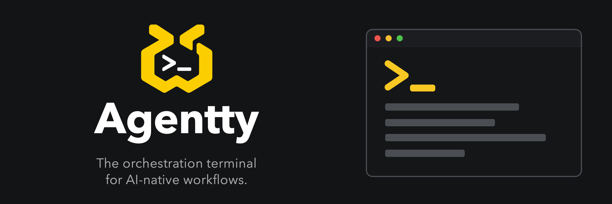

<p align="center">
  
</p>

<p align="center"><b>나를 위한 멀티 오케스트레이션 AI 터미널</b></p>

<p align="center">
  <a href="https://www.agentty.run">agentty.run</a> ·
  <a href="https://www.agentty.run/docs">가이드</a> ·
  <a href="https://github.com/empty-user77/agentty-releases/releases">다운로드</a> ·
  <a href="https://x.com/agentty_run">@agentty_run</a>
</p>

<p align="center">
  <a href="README.md">English</a> ·
  <b>한국어</b> ·
  <a href="README.ja.md">日本語</a> ·
  <a href="README.zh.md">中文</a>
</p>

<p align="center">
  <a href="LICENSE"></a>
  
  
</p>

Agentty는 **Claude Code**, **Codex**, 그리고 셸을 한 창에서 나란히 돌리는 네이티브 GPU 렌더링 터미널입니다. 어떤
에이전트가 작업 중인지, 어떤 에이전트가 끝났는지, 어떤 에이전트가 답을 기다리는지 보여 주고, 각 에이전트에게 작업에
필요한 것 — 프로젝트의 파일, Git 이력, 컨테이너, 데이터베이스 — 을 함께 쥐여 줍니다.

Rust + [GPUI](https://gpui.rs) + `alacritty_terminal`로 만들었습니다. Electron은 쓰지 않습니다.

## Agentty를 쓰는 이유

- **모든 에이전트를 한 창에서** — 워크스페이스 · 탭 · 분할창 구조가 재시작 후에도 그대로 복원됩니다. 터미널, Claude
  Code, Codex는 물론 Gemini, Copilot, Cursor, OpenCode, Amp, Aider, 로컬 Ollama 모델까지 같은 메뉴에서 시작합니다.
- **에이전트 상태를 구분합니다** — 페인과 워크스페이스마다 작업 중 · 완료 · 응답 대기를 실시간으로 표시하고, 답이
  필요한 페인에 테두리가 켜집니다. 데스크톱 알림과 메뉴 막대는 물론, 자리를 비웠을 때는 Slack · Discord · Telegram
  으로도 보내 줍니다.
- **세션끼리 맥락을 넘깁니다** — 두 에이전트 사이에 선을 이어 대화를 넘기고, 양방향으로 계속 동기화하거나, Claude
  Code ↔ Codex로 세션을 옮길 수 있습니다.
- **충돌 없는 병렬 작업** — 같은 프로젝트에 두 번째 에이전트가 들어오면 새 브랜치의 별도 git 워크트리에서 시작할지, 쓰던 워크트리를 함께 쓸지 묻고,
  에이전트가 작업을 여러 세션으로 나누자고 요청하면 확인 후 한 번에 시작됩니다.
- **터미널 이상의 것들** — 편집기가 붙은 파일 패널, GitHub Desktop 스타일 Git 페이지, Docker 패널, 데이터베이스
  페이지, 인앱 브라우저, 사용량·비용 모니터링, 이 PC의 모든 git 워크트리 관리(미커밋·병합 여부 확인, 여러 개 한 번에
  삭제), 빌드 결과물·도구 캐시를 정리하는 디스크 관리, 스킬·서브에이전트·MCP 서버를 모아 보는 확장 페이지.
- **데이터를 조심히 다룹니다** — 에이전트의 DB 조회는 읽기 전용 트랜잭션 안에서 실행되고, 쓰기는 실행할 문장을 그대로
  보여 주는 승인창을 통과해야만 실행됩니다. 비밀값은 OS 자격증명 저장소에 두고, 대화 기록과 프롬프트는 기기를 떠나지
  않습니다.

기능 전체 설명은 **[agentty.run/docs](https://www.agentty.run/docs)** 에 있습니다.

## 설치

[agentty-releases](https://github.com/empty-user77/agentty-releases/releases)에서 내려받으세요.

| 플랫폼 | 파일 |
|---|---|
| macOS 13+ (Apple Silicon) | `Agentty-X.Y.Z-…-arm64.dmg` — 서명·공증 완료 |
| Windows 10 1809+ (x64) | `Agentty-X.Y.Z-windows-x64-setup.exe` — 사용자 단위 설치, 관리자 권한 불필요 |
| Debian 12+ / Ubuntu 22.04+ | `Agentty-X.Y.Z-linux-amd64.deb` — `sudo apt install ./Agentty-*.deb` |
| RHEL 9+ / Fedora | `Agentty-X.Y.Z-linux-x86_64.rpm` — `sudo dnf install ./Agentty-*.rpm` |

업데이트는 Agentty가 직접 처리합니다. macOS와 Windows에서는 새 버전을 설치하고 재시작하며, Linux에서는 새 패키지를
안내합니다.

### 소스에서 빌드

```sh
git clone https://github.com/empty-user77/Agentty.git
cd Agentty
cargo run --release -p agentty-app
```

Rust 1.98(`rust-toolchain.toml`에 고정)과 플랫폼별 빌드 도구가 필요합니다. Windows·Linux는
[docs/platforms.md](docs/platforms.md)를 참고하세요. `PATH`에 `claude` 또는 `codex`가 있으면 에이전트 탭이 열리고,
없는 도구는 설정 → 환경 점검에서 설치할 수 있습니다.

## 문서

| | |
|---|---|
| [기능 가이드](https://www.agentty.run/docs) | 앱의 각 화면과 기능 설명 |
| [docs/configuration.md](docs/configuration.md) | `settings.json`, 에이전트 로그인, 하네스, 데이터베이스, 테마, Agentty가 만드는 파일 |
| [docs/platforms.md](docs/platforms.md) | Windows·Linux에서 다른 점과 빌드 방법 |
| [docs/plugins](docs/plugins/README.md) | 플러그인 만들기(Node.js SDK, [프로토콜](docs/plugins/protocol.md))와 [사용법](docs/plugins/usage.md) |
| [docs/architecture.md](docs/architecture.md) | 크레이트·터미널·에이전트 소켓·패널의 구조 |
| [docs/metrics.md](docs/metrics.md) | 공식 빌드가 보낼 수 있는 이벤트 전체와 끄는 방법 |
| [docs/release.md](docs/release.md) | 패키징·서명·공증과 릴리즈 채널 |

## 단축키

| 동작 | 단축키 |
|---|---|
| 새 터미널 / Claude Code / Codex 탭 | ⌘T / ⌥⌘C / ⌥⌘X |
| 오른쪽 / 아래로 분할 | ⌘D / ⇧⌘D |
| 다음·이전 페인 · 탭 · 워크스페이스 | ⌘] ⌘[ · ⇧⌘] ⇧⌘[ · ⌥⌘↓ ⌥⌘↑ |
| 명령 팔레트 · 안 읽은 알림으로 이동 | ⇧⌘P · ⇧⌘U |
| Git · 세션 연결 · 모니터링 · 설정 | ⇧⌘G · ⇧⌘F · ⌥⌘U · ⌘, |
| 파일 패널 · 인앱 브라우저 · 미니 모드 | ⌥⌘B · ⇧⌘B · ⌃⌘M |

전체 목록은 **설정 → 단축키**에 있습니다. Windows·Linux에서는 ⌘ → Ctrl+Shift, ⇧⌘ → Ctrl+Alt+Shift,
⌥⌘ → Ctrl+Alt로 바뀌어 Ctrl+문자 조합은 셸이 그대로 받습니다.

## 플러그인

플러그인은 터미널 옆 패널을 채우고, 에이전트 페인 위에 버튼과 명령 팔레트 항목을 추가하며, 프롬프트를 보낼 수
있습니다 — 어디로 보낼지는 항상 "보낼 위치 선택" 창에서 사용자가 고릅니다. 플러그인은 별도 프로세스로 실행되고
매니페스트에 선언한 일만 할 수 있으며, 그 목록은 설치 전에 플러그인 페이지에서 확인할 수 있습니다. 기본 제공되는
**Cosmica** 플러그인은 [Cosmica](https://www.cosmica.ink/) 노트를 프롬프트로 바꾸고 세션 요약을 다시 저장합니다.

자세한 내용은 [docs/plugins](docs/plugins/README.md)를 보세요. 플러그인 페이지에서 새 플러그인을 만들고 Claude
Code에게 구현을 맡길 수도 있습니다.

## 개인정보

세션 목록, 사용량 계산, 컨텍스트 전달을 위해 에이전트 대화 기록을 **로컬에서만** 읽습니다. 프롬프트, 출력, 경로,
저장소 데이터는 전송하지 않으며, 에이전트 상태 훅은 사용자 계정 전용 소켓으로만 통신합니다.

공식 릴리즈 빌드는 익명 사용 정보(어떤 기능을 썼는지, 앱과 시스템 버전, 무작위 설치 ID)를 보냅니다. 설정 → 일반에서
끌 수 있으며 `DO_NOT_TRACK=1`로도 꺼집니다. 소스 빌드는 아무것도 보내지 않습니다.
전체 이벤트 목록은 [docs/metrics.md](docs/metrics.md)에 있습니다.

## 기여

기여를 환영합니다. [CONTRIBUTING.md](CONTRIBUTING.md)와 [행동 강령](CODE_OF_CONDUCT.md)을 먼저 읽어 주세요. 보안
문제는 [SECURITY.md](SECURITY.md)를 참고하세요.

## 라이선스

```
Copyright 2026 LEE YONGBEOM

Licensed under the Apache License, Version 2.0 (the "License");
you may not use this file except in compliance with the License.
You may obtain a copy of the License at

   http://www.apache.org/licenses/LICENSE-2.0

Unless required by applicable law or agreed to in writing, software
distributed under the License is distributed on an "AS IS" BASIS,
WITHOUT WARRANTIES OR CONDITIONS OF ANY KIND, either express or implied.
See the License for the specific language governing permissions and
limitations under the License.
```

전문은 [LICENSE](LICENSE)에 있습니다.

내장 글꼴과 서드파티 구성요소는 각자의 라이선스를 따릅니다 — [THIRD_PARTY_NOTICES.md](THIRD_PARTY_NOTICES.md)를
보세요.
